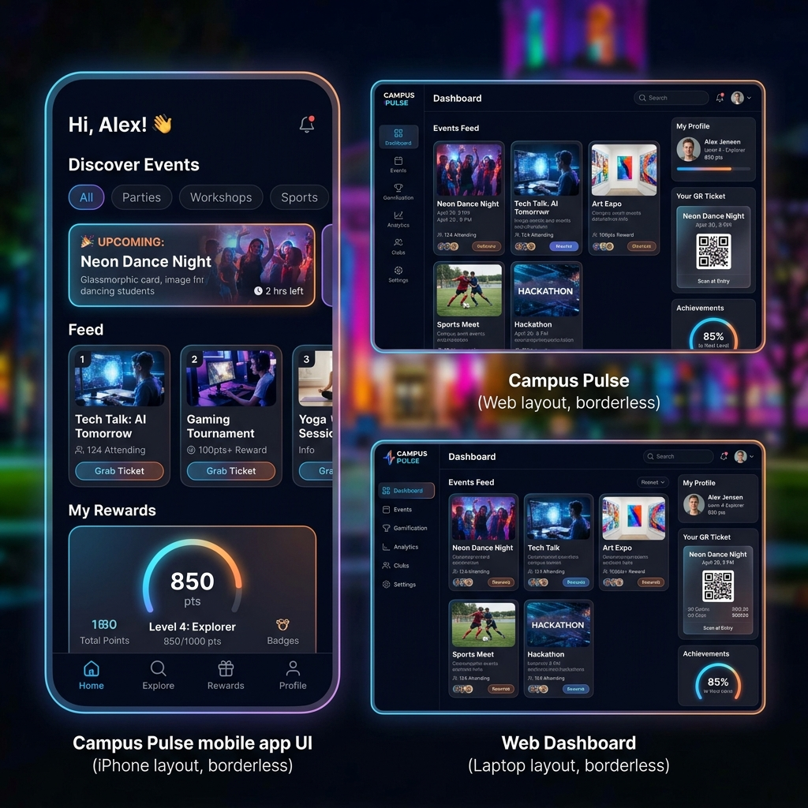

# CampusPulse: The Campus Nervous System

## Overview

CampusPulse is a comprehensive, gamified campus event ecosystem designed to connect students, faculty, staff, and campus organizations. It bridges the gap between event organizers and attendees by centralizing event discovery and incentivizing participation through a highly engaging, rewards-driven platform.

# Goal

The primary goal of CampusPulse is to solve the problem of fragmented event marketing and low student engagement on campus. By leveraging psychological principles like FOMO (Fear Of Missing Out) and dopamine-boosting gamification loops, the platform aims to maximize event attendance, streamline ticketing, and help students build a vibrant campus identity.

# Features

- Smart Event Discovery: Personalized home feeds filtering events by domain, category, and date.
- Frictionless Ticketing: One-tap registrations with digital QR tickets for seamless venue check-ins.
- Gamification & Rewards: Students earn points for attending events, unlock milestone badges, and compete on a campus-wide leaderboard.
- Organization Portal: A dedicated web dashboard for clubs to create events, track analytics, and manage attendance via a built-in QR scanner.
- Merchandise Store: An ecosystem economy where students can redeem their earned attendance points for actual club merchandise.
- Yearly Wrap: A Spotify-style annual recap of a student's campus engagement.

# Architecture

The system utilizes a decoupled, client-server architecture:

- Web Client (Organizations & Guests): A responsive web application handling administrative dashboards, event creation wizards, and public viewing.
- Mobile Client (Students/Staff): A cross-platform mobile application handling personalized feeds, QR tickets, and gamification interfaces.
- Backend (BaaS): A unified serverless backend managing secure authentication, real-time database synchronization, and cloud storage for media assets.

# Tech Stack

- Frontend (Web): Next.js 15, React 19, Tailwind CSS
- Frontend (Mobile): React Native, Expo, React Navigation
- UI/UX: Custom Glassmorphism, CSS/Reanimated animations, Lucide Icons
- Backend & Database: Firebase Auth, Firebase Firestore (NoSQL), Firebase Cloud Storage
- Language: TypeScript across the entire stack

# Challenges

- Schema Design: Architecting a complex NoSQL database schema capable of concurrently handling organization analytics, real-time ticket scanning, and gamified point calculations without bottlenecks.
- Cross-Platform Consistency: Maintaining a consistent, high-fidelity premium aesthetic (dark mode, glassmorphism, neon accents) across both a Next.js web application and a React Native mobile application.
- Engagement Engineering: Designing gamification mechanics that feel rewarding rather than tedious, balancing point economies between events and the merchandise store.

# Learnings

- Monorepo Management: Successfully structuring and managing independent web and mobile application environments within a single cohesive project repository.
- UI/UX Psychology: Gained deep insights into implementing behavioral design patterns (live counters, progress rings, confetti effects) to drive user retention.
- Serverless Ecosystems: Leveraged Firebase to rapidly prototype and integrate complex features like authentication and real-time syncing without the overhead of building a custom backend from scratch.

# Current Status

The project has successfully completed its Foundation & Design Phase. The high-fidelity, premium glassmorphic UI/UX mockups have been finalized. The repository structure is established with both the Next.js web application and the Expo mobile application initialized. Core UI components, routing, and shared constants have been securely committed to version control.

# Next Steps

- Phase 2 (Auth): Integrate Firebase Authentication for seamless login flows across both platforms.
- Phase 3 (Dashboard): Build out the web-based Organization portal to allow clubs to publish live events to the database.
- Phase 4 (Ticketing): Implement the core event registration loop and real-time QR code scanning functionality for attendance verification.