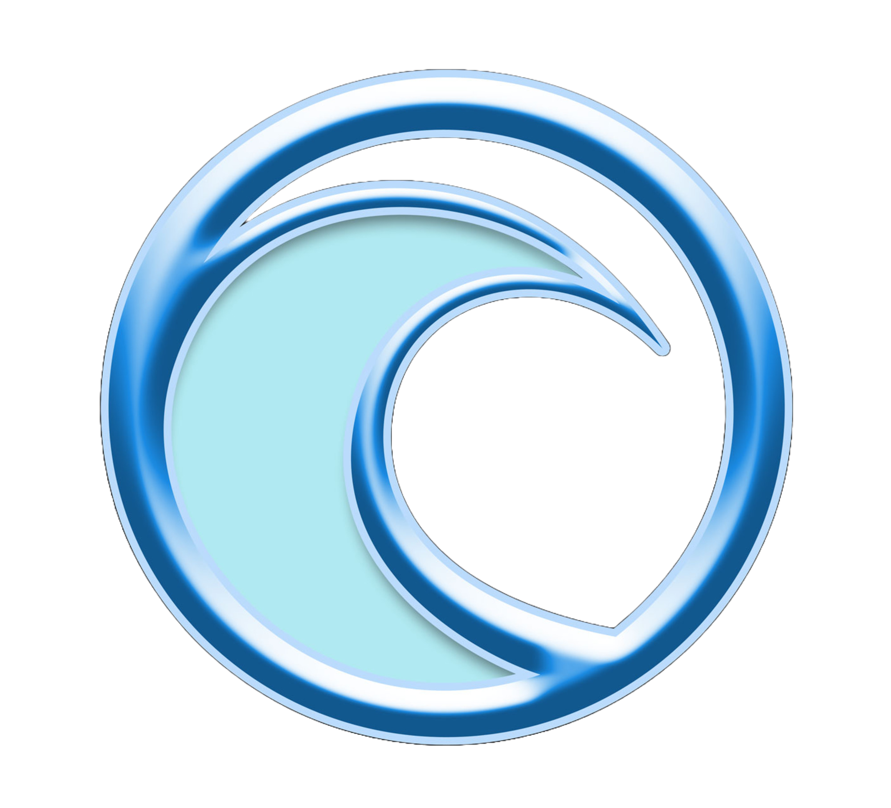

# Float-Chat AI: RAG on Global Oceanographic Data

## Overview

Float-Chat AI is a full-stack, AI-powered geospatial visualization platform designed to track, analyze, and interact with real-time oceanographic data. By integrating global Argo Float telemetry with advanced Large Language Models, the platform transforms raw oceanic metrics—such as temperature, salinity, and depth—into interactive, human-readable insights.

# Goal

To democratize access to complex oceanographic data by providing researchers, students, and marine enthusiasts with an intuitive, chat-driven interface. The system bridges the gap between massive geospatial datasets and end-users by using an AI assistant to query, summarize, and visualize deep-sea metrics dynamically.

# Features

- Real-Time Global Ocean Map: Interactive 2D mapping interface featuring dynamic float markers and historical trajectory polylines.
- AI Data Analyst: An integrated chat assistant (powered by Google Gemini) capable of answering complex queries about specific floats, regions, and historical trends using Retrieval-Augmented Generation (RAG).
- Streaming Data Visualization: Dynamic, real-time charts (via Recharts) displaying depth profiles, temperature gradients, and sensor health metrics.
- Semantic Vector Search: Advanced database architecture allowing the AI to rapidly search through thousands of historical float telemetry records based on natural language intent.
- Production-Ready Containerization: Fully orchestrated Docker environment ensuring seamless setup, deployment, and scalability.

# Architecture

The application is built on a modern, decoupled microservices architecture:

- Client Tier (Frontend): A React/Vite single-page application handling state management, map rendering, and real-time chart updates.
- API Gateway & Application Logic (Backend): A high-performance FastAPI service that orchestrates REST endpoints, processes geospatial queries, and manages the AI context window.
- Data & AI Layer (Database): A PostgreSQL database utilizing the pgvector extension. Data is ingested via custom Python pipelines that format and embed float telemetry for fast semantic retrieval by the Gemini LLM.
- Infrastructure: Managed entirely via Docker Compose, bridging the frontend network, backend API, and database into a unified local cluster.

# Tech Stack

- Frontend: React, TypeScript, Vite, Tailwind CSS, Shadcn UI, Recharts, React-Leaflet.
- Backend: Python 3, FastAPI, SQLAlchemy, Pydantic, Uvicorn.
- AI & Data Science: Google Gemini API (google-genai), LangChain concepts, FAISS.
- Database: PostgreSQL with pgvector extension.
- DevOps & Infrastructure: Docker, Docker Compose, Node.js, Puppeteer (for automated UI testing/capture).

# Challenges

- Spatio-Temporal AI Queries: Bridging the gap between natural language (e.g., "Show me floats getting colder in the Atlantic") and strict database geospatial queries required careful prompt engineering and intermediate API routing.
- Data Aggregation: Consolidating disparate CSV data sets and unstructured telemetry into a unified, clean database schema suitable for real-time frontend streaming.
- Map Trajectory Syncing: Ensuring that the interactive map rendered complex historical polyline paths smoothly without blocking the main UI thread during asynchronous API fetches.

# Learnings

- RAG on Geospatial Data: Gained deep experience in applying Retrieval-Augmented Generation to highly structured, numerical, and geographic datasets, which requires different strategies than standard text-based RAG.
- Full-Stack Orchestration: Mastered the complexities of Dockerizing multi-tier applications, managing environment variables, and ensuring container health-checks and network dependency ordering.
- Premium UI/UX Design: Learned to implement sleek, modern design systems (glassmorphism, neon accents) to make heavy, data-dense applications feel lightweight, premium, and accessible.

# Current Status

V1 Production-Ready: The project has successfully transitioned from an experimental script-based tool to a robust, containerized application. The frontend, backend, and vector database seamlessly communicate, and high-fidelity portfolio assets have been successfully captured.

# Next Steps

- Cloud Deployment: Migrate the containerized stack to a managed cloud environment (e.g., AWS ECS, Google Cloud Run, or Vercel/Render).
- Predictive Analytics: Implement machine learning models to forecast future float trajectories and ocean temperature shifts based on historical data.
- Extended Data Integration: Expand the data ingestion pipeline to include overlapping satellite imagery and live weather telemetry for richer contextual analysis.