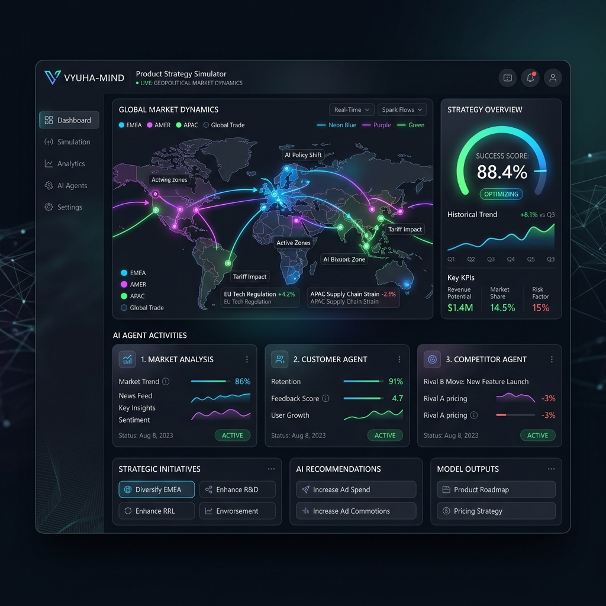

# Vyuha-Mind: Autonomous Product Strategy Simulator

## Overview

**Autonomous Multi-Agent Product Strategy Simulator** — An intelligent product strategy validation engine powered by multi-agent AI reasoning. Uses Claude, Grok, and Google Gemini to simulate product market dynamics, competitive landscapes, and investor sentiment in real-time across various geopolitical scenarios.

**What it does:**
- Validates product-market fit in minutes instead of months
- Tests pricing & positioning strategies against competitor responses
- Understands market risks in specific geopolitical scenarios
- Generates quantified investment theses for pitch decks
- A/B tests strategic variations

---

## Goal

Build an intelligent, scalable product strategy validation engine that:

1. **Simulates realistic market dynamics** using four specialized AI agents
2. **Provides actionable recommendations** backed by multi-step reasoning
3. **Handles geopolitical complexity** (LPG crisis, E10/E20 transition, supply disruptions)
4. **Gracefully degrades** when APIs fail (deterministic fallbacks for robustness)
5. **Works at enterprise scale** with concurrent simulations, high availability

---

## Features

### Core Features

- **Multi-Agent Reasoning** — 4 specialized AI agents running in parallel
  - 🌍 **Market Analysis Agent** (Grok): Real-time geopolitical intelligence
  - 👥 **Customer Agent** (Claude): Demand forecasting & sentiment analysis
  - 🎯 **Competitor Agent** (Claude): Competitive response modeling
  - 💰 **Investor Agent** (Claude): Risk/return & investment viability

- **Scenario-Based Simulation** — Pre-built geopolitical scenarios
  - LPG Crisis (India, 2026)
  - E10/E20 Fuel Efficiency Transition
  - Custom crisis scenarios

- **Strategic Recommendations** — AI-generated strategy variations
  - Price optimization (penetration, premium, value-based)
  - Feature positioning tweaks
  - Go-to-market timing analysis
  - Risk mitigation strategies

- **Interactive Dashboard** — Real-time visualization
  - Live agent reasoning logs
  - KPI panels (demand, competition, risk, confidence)
  - Market arena competitive landscape
  - Sentiment heatmaps & competitor matrices

- **Comprehensive Evaluation** — Quantified scoring
  - Success score (0-100)
  - Status categorization (HIGH_POTENTIAL, MODERATE, RISKY, FAIL)
  - Detailed breakdown of demand, competition, confidence, risk
  - Risk flags & warnings

- **Robust Error Handling** — Production-grade resilience
  - Agent timeout protection (12-second limits)
  - API fallback chains (Grok → free sources → ADK → deterministic)
  - Graceful degradation (simulation never fails due to API issues)
  - Comprehensive logging & diagnostics

---

## Architecture

![[Vyuha-Mind.jpeg]]

---

### AI Model Assignment

| Component | Model | Reason |
|---|---|---|
| **Market Analysis** | Grok 3.0 | Real-time geopolitical + X/Twitter data |
| **Customer Agent** | Claude 3.5 Sonnet | Deep behavioral reasoning |
| **Competitor Agent** | Claude 3.5 Sonnet | Strategic competitive thinking |
| **Investor Agent** | Claude 3.5 Sonnet | Financial risk/return evaluation |
| **Recommendation Engine** | Claude 3.5 Sonnet | Synthesis & strategic advice |

---

## Tech Stack

### Backend
- **Language**: Python 3.9+
- **Framework**: FastAPI 0.135.2 (async, type-safe)
- **Data Validation**: Pydantic 2.12.5
- **APIs**: Google ADK 1.27.5, Google GenAI 1.56.0, Grok (X AI), RSS/Reddit/Wikipedia
- **Parsing**: python-docx, pdfplumber
- **Math**: NumPy 1.26.4

### Frontend
- **Framework**: React 18.3.1 (hooks, context, suspense)
- **Build Tool**: Vite 6.2.5
- **Styling**: TailwindCSS 4.1.3
- **Charts**: ECharts 6.0.0 + Recharts 2.15.3
- **Animations**: Framer Motion 12.38.0
- **Icons**: Lucide React 0.475.0

### DevOps
- **API Docs**: FastAPI auto-generated Swagger UI
- **CORS**: Enabled for development
- **Environment**: .env-based configuration
- **Containerization Ready**: Docker-compatible

---

## Challenges

### 1. Agent Timeout Resilience
**Problem**: LLM APIs sometimes hang or respond slowly  
**Solution**: 12-second timeout per agent with ThreadPoolExecutor, graceful fallback  
**Learning**: Timeouts must be aggressive but fair; balance reliability with accuracy

### 2. Real-Time Market Data Quality
**Problem**: Free sources (RSS, Reddit, Wikipedia) are inconsistent  
**Solution**: Cascading fallback chain (Grok → free → ADK → deterministic)  
**Learning**: Always have deterministic fallback; don't rely entirely on live APIs

### 3. Agent Reasoning Consistency
**Problem**: LLMs produce variable outputs, sometimes missing fields  
**Solution**: Strict output schema validation, required key checking, safe defaults  
**Learning**: Deterministic logic + optional LLM enhancement = best of both

### 4. Geopolitical Scenario Modeling
**Problem**: Hard to model how crises affect customer/competitor behavior  
**Solution**: Pre-built scenario templates with adjustable parameters  
**Learning**: Start with concrete scenarios, then generalize patterns

### 5. Frontend Real-Time Updates
**Problem**: Need to show agent reasoning as simulation progresses  
**Solution**: Async backend + WebSocket-ready architecture  
**Learning**: Separate concerns: results vs. progress vs. logs

---

## Learnings

### 1. Multi-Agent Orchestration
- Parallel execution > sequential (significant latency improvements)
- Timeout handling is critical for production reliability
- Deterministic fallbacks are more important than perfect LLM outputs

### 2. API Resilience
- Design for failure: assume every API call might fail
- Cascading fallbacks create robust systems (never block the user)
- Cache market analysis results when possible (reduces API calls)

### 3. Market Simulation
- Blending deterministic + LLM reasoning provides best accuracy
- Convergence detection (early stop) improves performance without sacrificing quality
- Step-based adjustments improve realism

### 4. Frontend/Backend Separation
- Stateless backend makes scaling easier
- Clear API contracts (Pydantic models) prevent integration bugs
- Interactive dashboards require deep frontend architecture

### 5. Error Messages Matter
- Transparent error codes help debugging
- Users want to know why recommendations differ
- Diagnostics data is valuable for optimization

---

## Current Status

### ✅ Completed
- [x] Core multi-agent orchestration (market, customer, competitor, investor agents)
- [x] Market analysis with Grok integration + free source fallbacks
- [x] Simulation engine with convergence detection
- [x] Evaluation & scoring engine
- [x] Recommendation generation engine
- [x] FastAPI backend with full API (health, simulate, recommend)
- [x] React + Vite frontend dashboard
- [x] Document parsing (PRD extraction from DOCX/PDF)
- [x] Comprehensive type hints & Pydantic validation
- [x] Error handling & timeouts
- [x] Professional documentation (README, CONTRIBUTING, etc.)

### 🎯 In Progress
- [ ] WebSocket real-time updates (agent logs streaming)
- [ ] Batch simulation runner for A/B testing
- [ ] Advanced caching layer (market context caching)

### 📋 Planned
- [ ] Historical data persistence & analytics
- [ ] Custom agent personas (domain-specific reasoning)
- [ ] PDF/PPT report export
- [ ] Docker containerization
- [ ] GitHub Actions CI/CD
- [ ] Horizontal scaling with load balancer

---

## Resources

- **GitHub**: [Vyuha-Mind](https://github.com/KrishnaSrinivas-24/Vyuha-Mind.git)
- **Project Assets & PPTs**: [Google Drive](https://drive.google.com/drive/folders/1ES2mXXCWrBqfzyGqjR9yEwTbyqSp_JD8?usp=sharing)
- **API Docs**: http://127.0.0.1:8000/docs
- **Frontend**: http://localhost:5173

---

## Key Metrics

| Metric              | Value          | Target         |
| ------------------- | -------------- | -------------- |
| **Simulation Time** | ~10-15 sec     | < 30 sec       |
| **Agent Timeout**   | 12 seconds     | No agent hangs |
| **Fallback Rate**   | ~20%           | < 50%          |
| **Frontend Bundle** | ~200KB gzipped | < 300KB        |
| **Type Coverage**   | 100% Python    | 100%           |
| **API Endpoints**   | 3              | 5+             |
